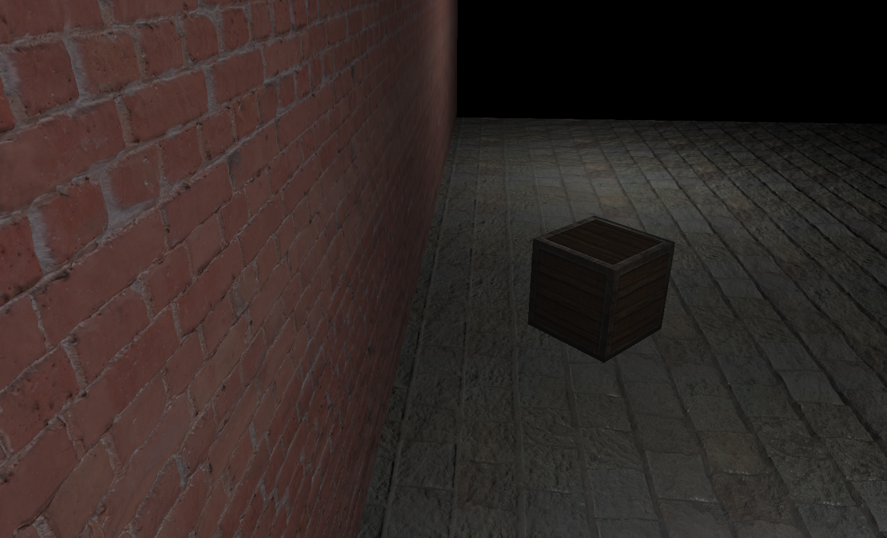

# Экспериментальная ветка - трассировка лучей на Vulkan
Трассировка лучей с использованием расширения VK_KHR_RAY_TRACING. Данная ветка экспериментальная, во многих местах архитекстура рендерера
требует серьезного переосмысления с учетом особенностей подходов используемых при трассировке лучей на Vulkan.

На данный момент реализовано:
 - Тени (мягкие тени шумные, без денойзинга)
 - Отражения

Код писался и тестировался при помощи следующего набора инструментов
 - CLion (IDE)
 - MinGW или MSVC (Компиляция и сборка)
 - Vulkan SDK 1.2.154.1 (Должен быть скачан и установлен отдельно)

Вы можете открыть данный проект при помощи IDE с поддержкой CMake (CLion, Visual Studio 2019) и собрать его, 
либо сгенерировать файлы проекта для подходящей IDE (данный вариант не проверялся).

Для того чтобы использовать расширение VK_KHR_RAY_TRACING вам потребуются бета драйвера c поддержкой данного расширения Vulkan, также необхожимо убедиться что трассировка улчей на уровне API поддерживается вашей видео-картой. Для карта NVidia драйвера можно найти [здесь](https://developer.nvidia.com/vulkan-driver), как и перечень видео-карт поддерживающих трассировку лучей.

